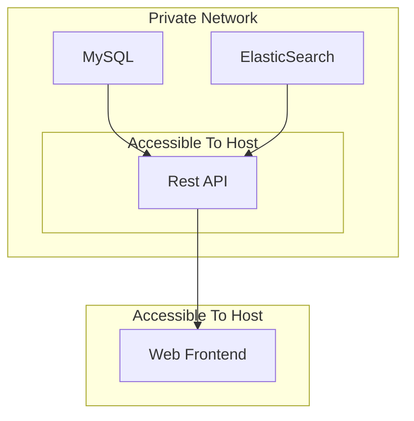

# Discount Detective (Multiplatform)
Discount Detective is a supermarket price comparision app that allows you to compare the prices of goods between a variety of local and non-local retailers.

This project is intended to be a multiplatform fork of the [original Android app](https://github.com/SheaSmith/discount-detective), which allows it to run on desktop, Android, web and eventually iOS, all while sharing much of the UI and data model code (but not backend code due to the original apps reliance on Firebase).

Currently, the app has a subset of the feature set of the original app, but it is intended that this will reach parity as Jetbrains Compose matures, and this app might eventually replace the original.

## Technical Structure
For the code parts of the app, there are two parts.

Firstly, there is the REST API, which is a Kotlin based Spring Boot application, which integrates into a MySQL database and an ElasticSearch instance. It shares the scraper code from the Android app, along with the generic data models. This is the part of the application which is reponsible for scraping the supermarket pricing information, which it will do in the background on start and every day at 2am. It also provides
several REST endpoints for searching and getting information about products for the app to use, along with providing a CORS proxy to allow the retrieval of the product images when the frontend is running on a web
browser.

Secondly, there is the frontend. This is a Kotlin Multiplatform project that uses Jetbrains Compose for the UI layer. The UI is a fork of the original Android UI, and so the code is not identical, however, most of it (>90% probably) is the same across both of the projects. Currently, the intended target is web browsers, via the experimental WASM support of Kotlin Multiplatform and Jetbrains Compose. As the UI layer relies on experimental technologies, it may be a bit buggy. **Additionally, the app will only run in modern web browsers due to the requirement of modern Web Assembly technologies!**

## Deployment Structure
The app uses Vagrant and four VMs for deployment, all of which are Ubuntu 20.04 based.

The first is a VM for the MySQL instance, which on deployment, will install and run a MySQL server, and initialise the database (but it will not create tables, as that is the function of the API's data layer). If you are deploying this somewhere, please ensure you change the default passwords, as they are currently hardcoded to insecure values (make sure you do a find and replace, as the API uses one of these passwords in its configuration files). This is used for the main data storage of the app.

The second is an ElasticSearch VM. This is reasonably simple in that it just installs and runs an ElasticSearch instance. This is then initialised and eventually populated by the Hibernate Search library in the API. This is used specifically for searching products for the app search screen.

Thirdly, there is a VM for the API. On provision it will download the necessary dependencies for the API (Java for compiling the API). A second deployment script is run on every `vagrant up` that will do get the API files from the shared Vagrant folder, setup users and permissions, use the special deployment version of the configuration file (`application-deployed.properties` in the `api` folder) and create a Systemd service. The Systemd service then will compile and run the API. For a fresh provision this will be reasonably slow, as it has to download Gradle, associated dependencies and build caches, but on subsequent builds it will be much faster. Additionally, if you are provisioning all VMs at once, by the time the frontend compiles, the API will have compiled and run all of its scrapers.

Finally, there is a VM for the frontend. This creates a web server (Apache2), along with the necessary dependencies for compiling the app (Java once again). On every boot, it will pull down the files needed for the app from the Vagrant shared folder, and compile the app. This is part of the provisioning file, so you can monitor progress more easily. Once the app has been compiled to JavaScript, HTML and Web Assembly, it will be moved to the `/var/www/html` folder to be served to the user.

The following is a rough diagram of how the different VMs interact:

## Deployment
To deploy, simply run `vagrant up`. The VMs will provision unattended, and the API will load in data once it has compiled (both tasks occur in the background). Compilation information is available for the frontend by simply viewing the output of the provisioning command, but in order to view the compilation status of the API, you need to SSH in (e.g. through `vagrant ssh api`) and then view the Systemd logs for the service (`sudo journalctl -f -u discount-detective.service`).

Once the provisioning has completed, the frontend will be available at http://localhost:8081. The API is at http://localhost:8080, with ElasticSearch and MySQL being at localhost:9200 and localhost:3306 respectively.

## Local Development
To develop locally, the easiest way is to create VMs for the DB and ElasticSearch instances. You can do this by running `vagrant up db` and `vagrant up search` (assuming all other VMs have been halted). You will need to uncomment the port forwarding lines in the Vagrant file in order to do this (and then reload each VM).

You can then run the API and the frontend, and access them at the same addresses. If you wish to run the API and frontend concurrently locally, then make sure the API was started first, so it can claim port 8080, otherwise the frontend will try and get it. You can also run either of the components in their respective VM images if you only need to work on one component (e.g. `vagrant up api` for the API or `vagrant up web` for the frontend).

The VMs will automatically pull from the api/web folders of your current directory when deploying. To update their contents, you can simply run `vagrant reload` after you have made changes.